本仓库演示Unity在拥有大量动态游戏对象+对象交互情况下的性能优化演进过程。

* Unity: 2022.3.62f3
* CPU: 13th Gen Intel(R) Core(TM) i5-13490F | 2.50GHz
* RAM: 16.0 GB
* GPU: NVIDIA GeForce RTX 4060 | 8GB
* DISK: SSD
* System: Windows 11 专业版 x64 | 24H2 | 26100.4652

## 进程

* [ ] 10k 动态对象
* [ ] 100k 动态对象
* [ ] 1000k 动态对象

## 详细记录

### 10k规模 - 1 | FPS：3 (Editor)

| 行为               | 记录                                         | 截图                                                         |
| ------------------ | -------------------------------------------- | ------------------------------------------------------------ |
| 批量创建GameObject | 间隔：100ms<br />数量：100/次<br />总数：10k |  |
| 行为：每帧移动     | transform.Translate / Update                 |  |
| 预制件：Enemy01    | Capsule / Rigidbody                          | <br /> |
| 结果               | FPS：3                                       |         |

### 10k规模 - 2 | FPS：25 (Editor)

**针对 3 FPS 的现状，执行以下步骤：**

1. 开启 Dynamic Batching：但在 Built-in 渲染管线下没有帮助。

2. 开启 GPU Instancing：将 Batches > 10000 降低到 Batches < 100 ，但当前情况下FPS没有明显提升。
3. 分析 Profiler：确认瓶颈来源是物理系统（Rigidbody）。
4. **★ 移除 Enemy Prefab 上的 Rigidbody：平均FPS提升到 25 （避开PhysX transform -> collider 反向同步）。**


<center>Profiler - 性能瓶颈为Rigidbody</center>


| 行为                        | 记录                                                         | 截图                                                         |
| --------------------------- | ------------------------------------------------------------ | ------------------------------------------------------------ |
| 批量创建GameObject          | 间隔：100ms<br />数量：100/次<br />总数：10k                 |  |
| 行为：每帧移动              | transform.Translate / Update                                 |  |
| 预制件：Enemy01-NoRigidbody | Capsule<br />1. 移除Rigidbody<br />2. 使用自定义Material<br />3. 开启GPU Instancing | <br /> |
| 结果                        | FPS：25                                                      |  |

### 25k规模 - 1 | 编辑器 FPS：20 | 构建后 FPS：50

在当前逻辑下，提升GO数量到25k规模后，FPS稳定在10帧（编辑器运行）。

本轮优化完成后，编辑器内FPS稳定在 ~20 帧，构建后FPS稳定在 ~50 帧。


<center>当前性能基线</center>


**进行性能分析，得到以下主要信息：**

1. 基础：PlayerLoop -> 占用 60ms 总计算时间。
2. Camera.Render -> 26ms | 渲染耗时。
3. Update.ScriptRunBehaviourUpdate -> 15ms | MonoBehaviour脚本耗时（Update），共计调用 25000 次/帧。
4. FixedUpdate.PhysicsFixedUpdate -> 15ms | 物理系统同步Collider和Transform操作耗时。


**本轮优化着重以下2点：**

1. 降低25k对象情况下Update（移动逻辑）运行压力。
2. 降低渲染压力。


**Update（移动逻辑）运行压力分析：**

1. 携带Collider的GameObject在每一次transform发生位移时，会触发PhysX的同步（FixedUpdate.PhysicsFixedUpdate）。

2. 调用每一个MonoBehaviour时的逻辑链开销和Unity管理MonoBehaviour开销。

3. 直接设置transform.position速度高于transform.Translate。


**渲染压力分析：**

1. Mesh Renderer 阴影计算耗时（Render.OpaqueGeometry）。


**步骤 - 1：优化物理开销、移动开销、Mono开销 | FPS变化：10 -> 13**

1. 移除Collider：避开PhysX同步开销，提升FPS 10 -> ~12。
   
2. 集中管理移动逻辑：对Enemy去Mono化，降低 BehaviourUpdate 开销，~15ms -> ~7ms ，提升FPS ~12 -> ~13
   
   1. 引入 EnemyManager 管理所有对象实例，移除MonoBehaviour。
   2. 通过 EnemyManager 直接移动所有Transform。（至此 ~11ms）
   3. 使用直接设置坐标 `transform.localPosition += movement` 替代 `transform.Translate` ，加速。（至此 ~7ms）


<center>优化后帧率稳定到 ~13 帧</center>


**步骤 - 2：优化渲染开销**

1. 移除 Mesh Renderer 阴影渲染：降低 Render.OpaqueGeometry 开销 ~17ms -> ~5ms ，FPS变化 ~13 -> ~19 （编辑器内）。
   


<center>优化后帧率在构建后FPS稳定到 ~50 帧</center>


<center>优化后帧率在编辑器内FPS稳定到 ~20 帧</center>


### 100k规模 - 基线 | 编辑器 FPS：4 | 构建后 FPS：10

100k规模下构建后10FPS，已经接近传统Mono架构下的性能极限。


后续迭代将往现代技术栈推进：

* GPU Instancing + Compute Buffer + DrawMeshInstancedIndirect
* Entities + Hybrid Renderer（保留部分 GO 用于 UI/特效）
* Entities Graphics + GPU Resident Drawer（未来方向）


<center>编辑器FPS：4</center>


<center>构建后FPS：10</center>


### 100k规模 - 1 | 编辑器 FPS：5 | 构建后 FPS： ~13


**对镜头关闭Depth检测 + 关闭全局灯渲染后节省22ms时间。**

Main Light -> Shadow Type -> None


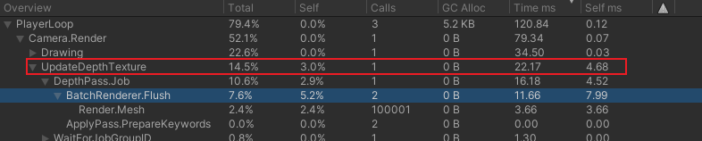


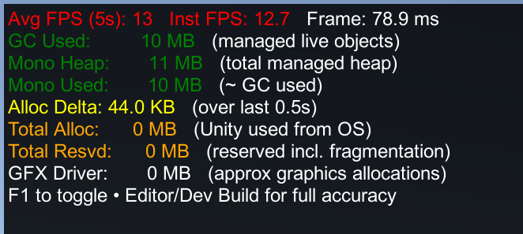

<center>构建后FPS：~13</center>


### 100k规模 - 2 | 编辑器 FPS：~57 | 构建后 FPS：~83

GPU Instancing + Compute Buffer + DrawMeshInstancedIndirect


**使用 Custom Unlit 开启 GPU Instancing + 调用 GPU 渲染后，在100k规模得到大幅提升。**

**原理：**CPU运算压力（100k规模的渲染请求）被大幅削减（只需要1次调用），充分利用GPU并行计算能力，实现快速渲染，充分释放主核CPU压力。


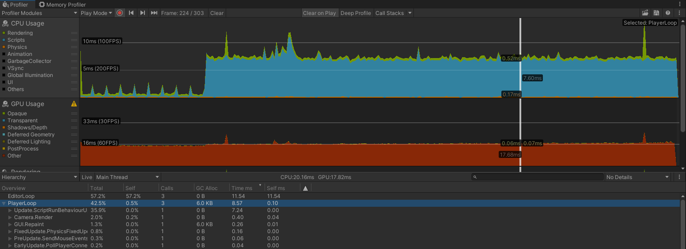


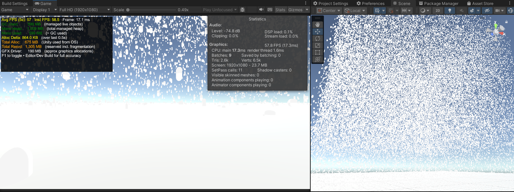


### 1000k规模 - 基线 | 构建后 FPS：~10


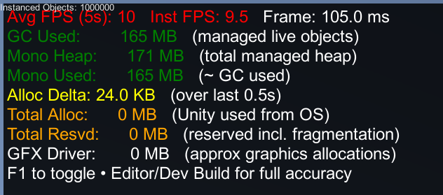

<center>构建后FPS：~10</center>


### 1000k规模 - 1 | 研究记录

*DynamicGO_X_1000k_1_Burst.unity*


在决定后续工作以前先确认瓶颈在哪里。

根据当前Profiler分析，PlayerLoop耗时100ms，其中99ms位于Update.ScriptRunBehaviourUpdate。

深入挖掘发现瓶颈在 `GPUTestBootstraper.Update()` 方法。

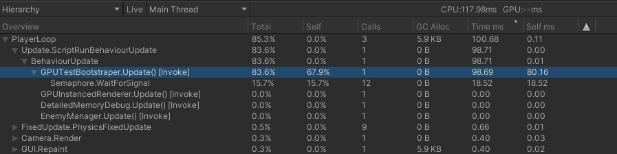


该方法调用EnemyManager，对所有实例进行Matrices更新，以实现动态物体的运动。

```c#
// GPUTestBootstraper.cs
private void Update()
{
    if (!started) return;

    EnemyManager.Instance.UpdateMatrices(Time.deltaTime);
}

// EnemyManager.cs
public void UpdateMatrices(float deltaTime)
{
    int count = positions.Length;

    // update positions, rotations, scales
    // [UpdatePositions]
    for (int i = 0; i < count; i++)
    {
        Vector3 position = positions[i];
        float raiseSpeed = raiseSpeeds[i];
        position.y += raiseSpeed * deltaTime;
        if (position.y >= 200f)
        {
            position.y = 0f;
        }
        positions[i] = position;
    }

    // structure Matrix4x4 array
    // [BuildMatrices]
    for (int i = 0; i < count; i++)
    {
        tempMatrices[i] = Matrix4x4.TRS(
            positions[i],
            rotations[i],
            scales != null ? scales[i] : Vector3.one
        );
    }

    // send gpu
    // UpdateGPU
    gpuRenderer.UpdateInstanceMatrices(tempMatrices, count);
}
```


为了更准确地判断性能卡点，引入 UnityEngine.Profiling 工具集。

```
Profiler.BeginSample("Label");
Profiler.EndSample();
```


引入 UpdatePositions, BuildMatrices, UpdateGPU 后得到3份性能点。

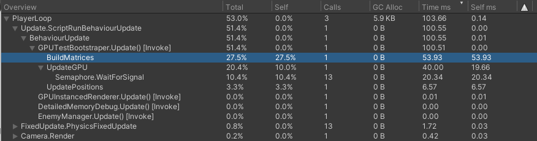


其中 UpdatePositions 耗时 6.57ms ，目前可以忽略。


**BuildMatrices**

BehaviourUpdate → GPUTestBootstraper.Update() → EnemyManager.UpdateMatrices() → BuildMatrices

几乎全部为CPU计算时间（Self ms 53.93 = Time ms 53.39，Calls = 1）


**UpdateGPU**

gpuRenderer.UpdateInstanceMatrices → ComputeBuffer.SetData

该部分主要为内存拷贝开销（1M × 64 bytes Matrix4x4 ≈ 64 MB/帧）。


**结论：**

**当前绝对主瓶颈：**CPU 每帧构建 1,000,000 个 Matrix4x4（通过 Matrix4x4.TRS + 数组赋值）。

* Matrix4x4.TRS 内部涉及矩阵乘法/构建，开销不小（尤其 1M 次）。

* 循环本身 + 数组写回也吃 CPU。

**次要瓶颈：**SetData 的 64 MB 拷贝（带宽压力）。

位置更新循环几乎可忽略。


#### 针对解决 - BuildMatrices


分别统计 Build / Write 性能，两者均占据大量时间。


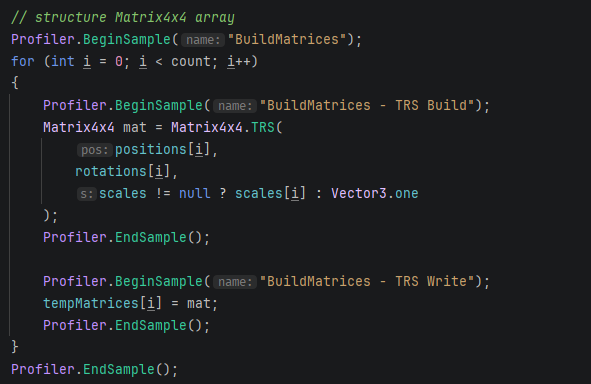


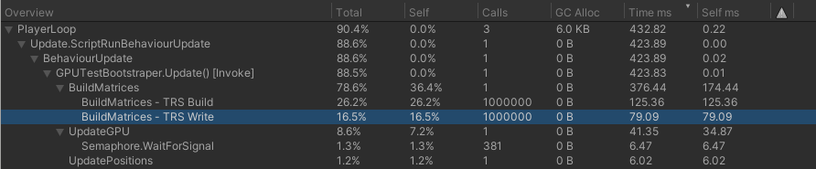


**TRS Build（Matrix4x4.TRS 调用本身）：**

矩阵构建的计算开销（内部的平移 × 旋转 × 缩放矩阵乘法）。

在1000k调用情况下，每次调用都有浮点运算负担。


**TRS Write（数组赋值）：**

纯内存写操作，但 1M 次循环 + 64 字节/矩阵 = 64 MB/帧 的写带宽压力也不小（尤其在缓存不友好时）。


**理解 Matrix4x4.TRS 的开销：**

* Matrix4x4.TRS 内部要做：

  - Quaternion → 旋转矩阵（涉及 sin/cos + 乘法）。

  - 缩放对角矩阵。

  - 平移矩阵。

  - 三矩阵相乘（9×9 浮点乘加）。

* Mono/IL2CPP 下每次调用消耗 ~几百纳秒，1M 次累积产生巨额负载压力。

* 数组写（Write）额外吃 L1/L2 缓存 miss + 内存带宽。


在1000k情况下，想要仅通过优化现有代码以大幅缓解主线程压力并实现大幅性能提升已不可能。

接下来引入 Burst + IJobParallelFor （Unity Jobs + Burst Compiler）。


#### 步骤：引入 Unity Jobs + Burst Compiler

目标：

* 把 CPU 端的 1M 次 `Matrix4x4.TRS` 计算 + 数组写 **并行化 + Burst 编译** 。
* 利用多核 CPU + SIMD 指令（Burst 的自动向量化），预期能把 BuildMatrices 的耗时从几百 ms 降到 `几十 ms 或更低` （受 CPU 核心数影响，通常 4–10 倍加速）。

前置条件：

* Unity 版本：2019.3+ （当前环境为 2022.3+）
* Packages
  * Jobs：默认已安装。
  * Burst：确保 Package Manager 安装了 Burst 。
  * Collections：确保 Package Manager 安装了 Collections (com.unity.collections) ，以使用NativeArray。


**定义兼容 Burst 的 Job 结构体：**

```c#
[BurstCompile(CompileSynchronously = true)]  // CompileSynchronously 第一次 Schedule 时就编译，避免卡顿
public struct BuildMatricesJob : IJobParallelFor
{
    [ReadOnly] public NativeArray<Vector3> Positions;
    [ReadOnly] public NativeArray<Quaternion> Rotations;
    [ReadOnly] public NativeArray<Vector3> Scales;  // 如果 scales 可为 null，需要处理

    public NativeArray<Matrix4x4> Matrices;  // 输出

    public void Execute(int index)
    {
        Vector3 pos = Positions[index];
        Quaternion rot = Rotations[index];
        Vector3 scale = Scales.IsCreated ? Scales[index] : Vector3.one;  // 处理 null scales

        Matrices[index] = Matrix4x4.TRS(pos, rot, scale);
    }
}
```


**在EnemyManager中添加NativeArray成员：**

```c#
// 在类字段中添加（Persistent 持久化，避免每帧分配）
private NativeArray<Vector3> nativePositions;
private NativeArray<Quaternion> nativeRotations;
private NativeArray<Vector3> nativeScales;
private NativeArray<Matrix4x4> nativeMatrices;
```


**初始化 NativeArray（在 Awake 或 Init 中）：**

```c#
private void Awake()
{
    _Instance = this;

    // 假设 InitMatrices() 已调用，或在这里初始化
    int count = positions.Length;

    nativePositions = new NativeArray<Vector3>(count, Allocator.Persistent);
    nativeRotations = new NativeArray<Quaternion>(count, Allocator.Persistent);
    nativeScales   = scales != null ? new NativeArray<Vector3>(count, Allocator.Persistent) : default;
    nativeMatrices = new NativeArray<Matrix4x4>(count, Allocator.Persistent);

    // 初始拷贝数据（只一次）
    nativePositions.CopyFrom(positions);
    nativeRotations.CopyFrom(rotations);
    if (scales != null) nativeScales.CopyFrom(scales);

    // tempMatrices 仍保留，用于后续 SetData（如果 gpuRenderer 需要 managed 数组）
    tempMatrices = new Matrix4x4[count];
}

private void OnDisable()  // 或 OnDestroy
{
    if (nativePositions.IsCreated) nativePositions.Dispose();
    if (nativeRotations.IsCreated) nativeRotations.Dispose();
    if (nativeScales.IsCreated) nativeScales.Dispose();
    if (nativeMatrices.IsCreated) nativeMatrices.Dispose();
}
```


**修改 UpdateMatrices（核心变化）：**

```c#
public void UpdateMatrices(float deltaTime)
{
    int count = positions.Length;

    Profiler.BeginSample("UpdatePositions");
    // 位置更新仍用普通循环（这个轻，可稍后 Job 化）
    for (int i = 0; i < count; i++)
    {
        Vector3 position = positions[i];
        position.y += raiseSpeeds[i] * deltaTime;
        if (position.y >= 200f)
        {
            position.y = 0f;
        }
        positions[i] = position;
    }
    Profiler.EndSample();

    Profiler.BeginSample("CopyPositionsToNative");
    nativePositions.CopyFrom(positions);  // 拷贝更新后的位置（~几 ms）
    Profiler.EndSample();

    Profiler.BeginSample("BuildMatricesJob");
    var job = new BuildMatricesJob
    {
        Positions  = nativePositions,
        Rotations  = nativeRotations,
        Scales     = nativeScales,
        Matrices   = nativeMatrices
    };

    // Schedule 并行执行（batchSize 64 是经验值，可调 32~128 看性能）
    JobHandle handle = job.Schedule(count, 64);
    handle.Complete();  // 同步等待完成（简单起步，后面可异步）
    Profiler.EndSample();

    Profiler.BeginSample("CopyToTempMatrices");
    nativeMatrices.CopyTo(tempMatrices);  // 拷贝回 managed 数组供 gpuRenderer 用
    Profiler.EndSample();

    Profiler.BeginSample("UpdateGPU");
    gpuRenderer.UpdateInstanceMatrices(tempMatrices, count);
    Profiler.EndSample();
}
```


引入 Burst 后：

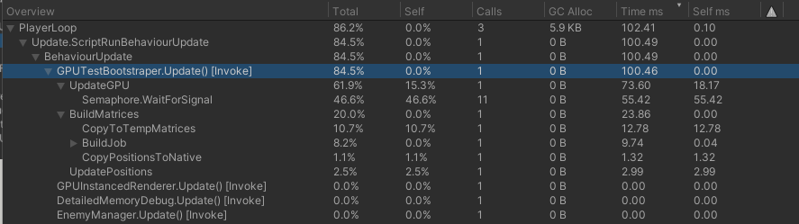

引入 Burst 前：


| 关键变化                | 引入前             | 引入后             |
| ----------------------- | ------------------ | ------------------ |
| UpdateGPU               | ~40ms (self ~20ms) | ~74ms (self ~18ms) |
| Semaphore.WaitForSignal | ~20ms (self ~20ms) | ~55ms (self ~55ms) |
| BuildMatrices           | ~54ms (self ~54ms) | ~24ms (self ~0ms)  |
| UpdatePositions         | ~7ms (self ~7ms)   | ~3ms (self ~3ms)   |


此处 UpdateGPU 不降反增，同步变化的是 Semaphore.WaitForSignal 。


**解读变化：**

* **BuildMatrices部分**（核心优化目标）：

  * 前：~54 ms Total / ~54 ms Self（全 CPU 单线程循环）
  * 后：~24 ms Total / ~0 ms Self（Job 调度 + Burst 编译）
    → **BuildMatrices 耗时直接砍掉 ~55%**（从 54 ms → 24 ms），此为 Burst + 并行 Job 预期收益（多核 + SIMD 加速 TRS 计算）。Job 本身几乎不占 Self 时间（Burst 高效），开销转移到调度和等待。

* **CopyToTempMatrices**：~12.7 ms（新引入）

  - NativeArray → managed array 的拷贝（64 MB 数据/帧），这是必须的，因为你的 gpuRenderer.UpdateInstanceMatrices 很可能期望 managed Matrix4x4[]。这部分开销是合理的，但会吃带宽。

* **UpdateGPU**：从 ~40 ms → ~74 ms（Self 从 ~20 ms → ~18 ms）

  - Total 上升，但 Self 几乎不变 → 说明 **UpdateGPU 本身没变慢**，增加的 ~34 ms 来自下面的子项。

* **Semaphore.WaitForSignal**：从 ~20 ms → ~55 ms（Self 从 ~20 ms → ~55 ms）

  - **最明显的回归**，但**不是 Bug 或 Burst 问题**。
  - **Semaphore.WaitForSignal** 在 Unity Profiler 中**不是主动消耗 CPU**，而是**主线程在等待其他线程/系统完成**（idle 等待）。
  - 在引入 Job 后，它增加的主要原因：
    - 主线程在 handle.Complete() 处 **同步等待 Job 完成** （你用了同步 Complete）。
    - 同时，Unity 的渲染管线（Gfx thread）在等待 GPU 完成上一帧（常见于 CPU 喂数据变快后，GPU 成为新瓶颈）。
    - 你的场景有 1M 实例 + DrawMeshInstancedIndirect，GPU 渲染压力大（顶点/像素填充、overdraw），CPU 优化后 GPU 更容易“跟不上”，导致主线程更频繁等待 Present/渲染同步。

  **整体帧时间**（PlayerLoop ~100–104 ms）几乎没变，甚至略有波动：

  - CPU 脚本部分（BuildMatrices）大幅优化，但**总时间被 Semaphore 等待 + Copy 抵消**。
  - 现在瓶颈**从 CPU 计算转移到 GPU 等待 + 数据拷贝**。


**当前状态：**

* Burst + Job 已成功优化 TRS 计算（~54 ms → ~24 ms）。
* 整体FPS没有明显提升：
  * handle.Complete() 同步阻塞 + CopyToTempMatrices 带宽开销。
  * GPU 侧现在更“饥饿”（CPU喂得更快），导致主线程等待 GPU Present 时间增加（Semaphore上升）。
* 问题转向：“CPU 重度瓶颈” → “CPU + GPU 平衡，但数据传输 + 同步开销突出”


**后续优化方向：**

* 异步 Job （消除同步 Complete 阻塞）
  * 不在 UpdateMatrices 里 `handle.Complete()` ，而是**延迟到下一帧或LateUpdate**。
  * 优点：主线程不阻塞，Semaphore 等待减少。
  * 缺点：可能有 1 帧延迟（运动稍滞后），但在 1M 物体海量渲染中通常可接受。
* 减少 CopyToTempMatrices 开销
  * Unity 支持 NativeArray 直接上传到 ComputeBuffer ，可以改成 **直接从 NativeArray SetData** 。
  * 可砍掉 ~12-13ms 的 CopyToTempMatrices 开销。
* 其它改动待定。


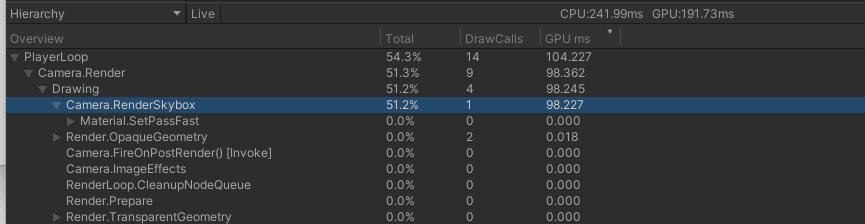

<center>瓶颈当前卡在GPU</center>


**GPU性能问题可能方向：**

* Overdraw + 填充率压力
* 顶点处理量巨大
* 材质/Shader 开销
* 没有 GPU culling


**GPU优化方向：**

* 增加 GPU culling（ComputeShader + argsBuffer 修改 instanceCount）
* 减少 overdraw
* 简化 Shader
* LOD + 距离 fade

