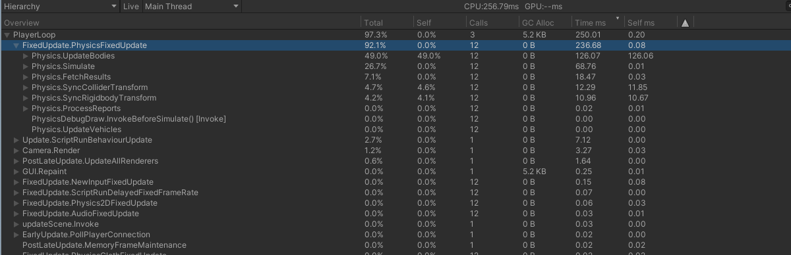
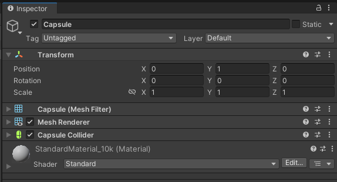
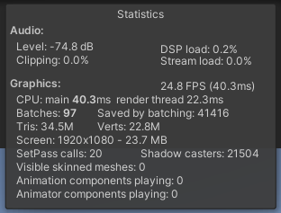
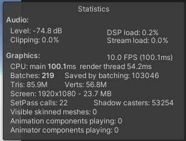
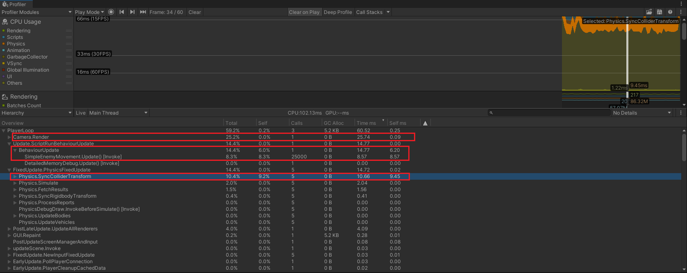

本仓库演示Unity在拥有大量动态游戏对象+对象交互情况下的性能优化演进过程。

* Unity: 2022.3.62f3
* CPU: 13th Gen Intel(R) Core(TM) i5-13490F | 2.50GHz
* RAM: 16.0 GB
* GPU: NVIDIA GeForce RTX 4060 | 8GB
* DISK: SSD
* System: Windows 11 专业版 x64 | 24H2 | 26100.4652

## 进程

* [ ] 10k 动态对象
* [ ] 100k 动态对象
* [ ] 1000k 动态对象

## 详细记录

### 10k规模 - 1 | FPS：3 (Editor)

| 行为               | 记录                                         | 截图                                                         |
| ------------------ | -------------------------------------------- | ------------------------------------------------------------ |
| 批量创建GameObject | 间隔：100ms 数量：100/次 总数：10k |  |
| 行为：每帧移动     | transform.Translate / Update                 |  |
| 预制件：Enemy01    | Capsule / Rigidbody                          |   |
| 结果               | FPS：3                                       |         |

### 10k规模 - 2 | FPS：25 (Editor)

**针对 3 FPS 的现状，执行以下步骤：**

1. 开启 Dynamic Batching：但在 Built-in 渲染管线下没有帮助。

2. 开启 GPU Instancing：将 Batches > 10000 降低到 Batches < 100 ，但对FPS没有明显帮助。
3. 分析 Profiler：确认瓶颈来源是物理系统（Rigidbody）。
4. **★ 移除 Enemy Prefab 上的 Rigidbody：平均FPS提升到 25 。**

Profiler - 性能瓶颈为Rigidbody

| 行为                        | 记录                                                         | 截图                                                         |
| --------------------------- | ------------------------------------------------------------ | ------------------------------------------------------------ |
| 批量创建GameObject          | 间隔：100ms 数量：100/次 总数：10k                 |  |
| 行为：每帧移动              | transform.Translate / Update                                 |  |
| 预制件：Enemy01-NoRigidbody | Capsule 1. 移除Rigidbody 2. 使用自定义Material 3. 开启GPU Instancing |   |
| 结果                        | FPS：25                                                      |  |

### 25k规模 - 1 | FPS：0 (Editor)

在当前逻辑下，提升GO数量到25k规模后，FPS稳定在10帧（编辑器运行）。

当前性能基线

**进行性能分析，得到以下主要信息：**

1. 基础：PlayerLoop -> 占用 60ms 总计算时间。
2. Camera.Render -> 26ms | 渲染耗时。
3. Update.ScriptRunBehaviourUpdate -> 15ms | MonoBehaviour脚本耗时（Update），共计调用 25000 次/帧。
4. FixedUpdate.PhysicsFixedUpdate -> 15ms | 物理系统同步Collider和Transform操作耗时。

**本轮优化着重以下2点：**

1. 降低25k对象情况下Update（移动逻辑）运行压力。
2. 降低渲染压力。

**渲染压力分析：**

**Update（移动逻辑）运行压力分析：**

1. 携带Collider的GameObject在每一次transform发生位移时，会触发PhysX的同步（FixedUpdate.PhysicsFixedUpdate）。

2. 调用每一个MonoBehaviour时的逻辑链开销。

**步骤：**

1. 移除Collider：避开PhysX同步开销，提升FPS 10 -> ~16 。
2. 
