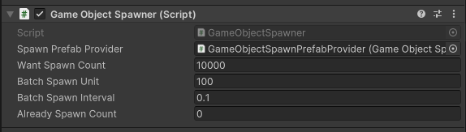
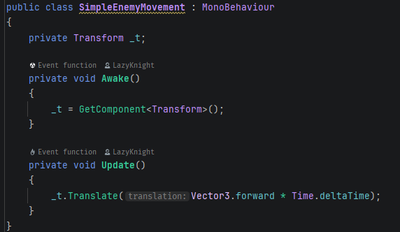
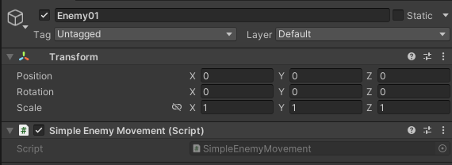
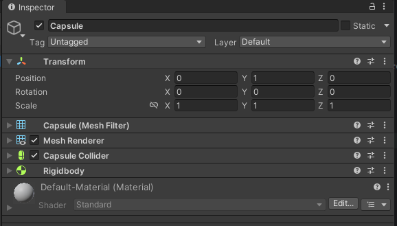
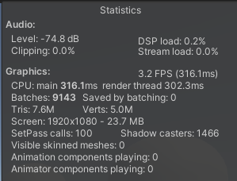

本仓库演示Unity在拥有大量动态游戏对象+对象交互情况下的性能优化演进过程。

* Unity 版本: 2022.3.62f3

## 进程

* [ ] 10k 动态对象
* [ ] 100k 动态对象
* [ ] 1000k 动态对象

## 详细记录

### 10k规模 - 1 | FPS：3

| 行为               | 记录                                         | 截图                                                         |
| ------------------ | -------------------------------------------- | ------------------------------------------------------------ |
| 批量创建GameObject | 间隔：100ms 数量：100/次 总数：10k |  |
| 行为：每帧移动     | transform.Translate / Update                 |  |
| 预制件：Enemy01    | Capsule / Rigidbody                          |   |
| 结果               | FPS：3                                       |         |

